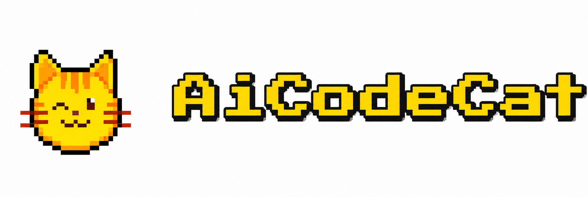

# URL-image（curl 生图技能）

<p align="center">
  
</p>

> Codex 生图技能 `image-curl` — 通过 `curl` 调用 OpenAI 兼容图片 API，完成文生图、图生图与图片编辑。

`URL-image` 仓库打包了面向 [aicode.cat](https://aicode.cat) API 中转聚合平台的 Codex 生图技能。它通过 `curl` 直接调用图片接口，读取本机 Codex API 凭据，并把结果保存为本地图片文件。

- 面向对话式生图，默认接入 `https://aicode.cat`
- 直接调用 `POST /v1/images/generations` 与 `POST /v1/images/edits`
- 默认模型：`gpt-image-2`
- 不依赖 `cpa`、`cliproxy-image-cli` 或其他额外生图 CLI
- 默认使用 `https://aicode.cat` 作为 base URL，生图专用 API Key 仅写入 skill 目录 `local.env`
- 将响应中的 `data[].b64_json` 解码保存为本地 `png`、`jpeg` 或 `webp` 文件
- **用户一旦提出生图或改图需求，Codex 必须调用本技能，不得跳过脚本直接作答**

## 功能

- 在 Codex 对话中通过 `$image-curl` 调用 aicode.cat 生成或编辑图片
- 默认使用 `https://aicode.cat`，生图专用 API Key 仅写入 skill 目录 `local.env`
- 直接使用 `curl -X POST https://aicode.cat/v1/images/generations`
- 直接使用多部分（multipart）`curl -X POST https://aicode.cat/v1/images/edits` 做图生图
- 自动解码响应里的 `data[].b64_json`
- 支持输出文件、metadata、覆盖保护、dry-run

本技能支持文字生成图片和基于本地图片的图生图/编辑，不做网页搜图或 SVG 编辑。

## 系统要求

本 skill 的脚本是 Bash 程序，依赖以下三个本机命令：

| 平台 | 脚本 | 额外依赖 |
|---|---|---|
| macOS / Linux | `generate_image.sh`、`edit_image.sh` | `bash`、`curl`、`python3` |
| Windows | `generate_image.ps1`、`edit_image.ps1` | PowerShell 5.1+、`curl.exe` |

### macOS

- 使用 `.sh` 脚本，在终端里按下方安装步骤执行即可。
- skill 安装路径：`~/.codex/skills/image-curl/`

安装前检查：

```bash
bash --version
curl --version
python3 --version
```

### Windows

- **推荐**直接在 **PowerShell** 里运行 `.ps1` 脚本，无需 Git Bash / WSL。
- 也可继续使用 `.sh` 脚本，但需 Git Bash 或 WSL。
- skill 安装路径：`%USERPROFILE%\.codex\skills\image-curl\`

安装前检查：

```powershell
$PSVersionTable.PSVersion
curl.exe --version
```

## 安装

```bash
git clone https://github.com/KonglingDaDa/URL-image.git
cd URL-image

mkdir -p ~/.codex/skills
cp -R ./skill_src/image-curl ~/.codex/skills/image-curl
chmod +x ~/.codex/skills/image-curl/scripts/generate_image.sh
chmod +x ~/.codex/skills/image-curl/scripts/edit_image.sh

cp ~/.codex/skills/image-curl/local.env.example ~/.codex/skills/image-curl/local.env
chmod 600 ~/.codex/skills/image-curl/local.env
```

Windows（PowerShell）额外无需 `chmod`；安装后直接用：

```powershell
$skill = Join-Path $env:USERPROFILE '.codex\skills\image-curl'
Copy-Item (Join-Path $skill 'local.env.example') (Join-Path $skill 'local.env')
```

如果你使用了自定义 `CODEX_HOME`：

```bash
mkdir -p "$CODEX_HOME/skills"
cp -R ./skill_src/image-curl "$CODEX_HOME/skills/image-curl"
chmod +x "$CODEX_HOME/skills/image-curl/scripts/generate_image.sh"
chmod +x "$CODEX_HOME/skills/image-curl/scripts/edit_image.sh"

cp "$CODEX_HOME/skills/image-curl/local.env.example" "$CODEX_HOME/skills/image-curl/local.env"
chmod 600 "$CODEX_HOME/skills/image-curl/local.env"
```

## 配置生图专用 Key（重要）

用户在密钥页面为「绿色生图专用分组」新生成的 Key，**只能配置在本 skill 内**，不要写入全局客户端配置。

**必须写入：**

```text
~/.codex/skills/image-curl/local.env
```

示例：

```bash
IMAGE_CURL_API_KEY=用户提供的生图专用-key
IMAGE_CURL_BASE_URL=https://aicode.cat
```

脚本启动时会自动 `source` 该文件，仅对本 skill 生效。

**禁止写入：**

- `~/.codex/auth.json`
- `~/.codex/config.toml`
- `~/.claude/settings.json` 或 Claude 全局配置
- 系统级 / 用户级全局环境变量（除非只是临时测试）

不要把生图专用 Key 提交到 Git，也不要写进对话日志。

安装完成后，用 dry-run 验证配置是否生效：

```bash
# macOS / Linux
~/.codex/skills/image-curl/scripts/generate_image.sh \
  --prompt "测试生图" \
  --output ./image-curl-test.png \
  --dry-run
```

```powershell
# Windows PowerShell
& "$env:USERPROFILE\.codex\skills\image-curl\scripts\generate_image.ps1" `
  --prompt "测试生图" `
  --output .\image-curl-test.png `
  --dry-run
```

确认输出中 `authorization` 为 `Bearer ***` 且 `endpoint` 指向 `https://aicode.cat` 后，再执行一次真实生图测试。

## 在 Codex 中使用

显式调用：

```text
$image-curl 可爱猫女
```

指定保存路径：

```text
$image-curl 生成一张横版赛博城市壁纸，保存为 ./cyber-city.png
```

普通图片请求也会触发本技能（无需手写 `$image-curl`）：

```text
画一只坐在窗边的橘猫，温暖自然光，保存到当前目录
```

图生图 / 图片编辑：

```text
$image-curl image="./photo1.png" prompt="把背景换成星空" output="./starry.png"
```

多图参考：

```text
$image-curl image="./photo1.png" image="./photo2.jpg" prompt="融合两张参考图，生成统一风格海报" output="./merged.png"
```

## 调用技能时传参

Codex 技能没有固定的参数协议。你可以在聊天里用 `key=value` 写清楚参数，Codex 会把它们转换成脚本参数。

常规参数：

```text
$image-curl prompt="可爱猫女" output="./catgirl.png" size="1024x1024" quality="auto" format="png"
```

自定义 base URL 和 API Key：

```text
$image-curl prompt="一只猫咪" output="./cat.png" base_url="https://aicode.cat" api_key="<API_KEY>"
```

自然语言写法也可以：

```text
$image-curl 画一只可爱猫咪，保存为 ./cat.png，尺寸 1024x1024，使用 base_url=https://aicode.cat，api_key=<API_KEY>
```

更推荐把 API Key 放在环境变量里，不要把真实 API Key发进聊天：

```text
$image-curl 画一只猫咪，保存为 ./cat.png，使用默认域名 https://aicode.cat 和环境变量 IMAGE_CURL_API_KEY
```

可在聊天中表达的常用参数：

```text
prompt, output, size, count, n, quality, format, output_compression, moderation, background, metadata, overwrite, dry_run, base_url, api_key
```

一次请求生成多张时使用 `count` 或 `n`：

```text
$image-curl prompt="四张不同风格的新疆旅游海报" output="./xinjiang-poster.png" size="1280x1920" count=4
```

这会向 API 传 `n=4`，并保存为：

```text
xinjiang-poster-1.png
xinjiang-poster-2.png
xinjiang-poster-3.png
xinjiang-poster-4.png
```

脚本会保存响应中 `data[]` 返回的所有图片。如果某个上游接受但忽略 `n` 参数，输出 JSON 会显示 `requested_count` 和 `returned_count`，用于识别这种不匹配。

压缩 WebP 输出：

```text
$image-curl prompt="两张猫咪头像" output="./cat.webp" size="1024x1024" format="webp" output_compression=80 count=2
```

图生图还支持重复传 `image`：

```text
$image-curl image="./photo1.png" image="./photo2.jpg" prompt="把背景换成星空" output="./edited.png"
```

`size` 可以写成 `auto` 或任意上游支持的 `宽x高`，例如：

```text
$image-curl prompt="新疆旅游宣传海报" output="./xinjiang.png" size="1280x1920"
```

不要为了适配固定尺寸强行裁剪；如果用户给出具体宽高且在上游范围内，就按原样传给接口。如果用户只说 1K、2K、4K 或横版/竖版，Codex 应按对应档位和方向选择合适宽高。

当前已确认的上游限制：

- 最长边必须小于等于 `3840`
- 宽和高都必须是 `16` 的倍数
- 最大宽高比是 `3:1`
- 总像素数必须在 `[655360, 8294400]`
- 例如横向长卷 4K 推荐用 `3840x1280`，不要用会被拒绝的 `4096x1024` 或 `3840x960`

## 直接运行脚本

### 文生图

```bash
~/.codex/skills/image-curl/scripts/generate_image.sh \
  --prompt "一只可爱的猫咪，毛茸茸的，正坐着看向镜头，干净背景，温暖自然光，写实风格，高质量" \
  --output ./cat.png \
  --size 1024x1024 \
  --count 1 \
  --quality auto \
  --format png \
  --moderation auto
```

### 图生图 / 图片编辑

```bash
~/.codex/skills/image-curl/scripts/edit_image.sh \
  --image ./photo1.png \
  --image ./photo2.jpg \
  --prompt "把背景换成星空，保留主体轮廓和服装细节" \
  --output ./edited.png \
  --size 1024x1024 \
  --count 1 \
  --quality auto \
  --format png \
  --moderation auto
```

保存 metadata：

```bash
~/.codex/skills/image-curl/scripts/generate_image.sh \
  --prompt "一张日系插画风格的可爱猫女头像" \
  --output ./catgirl.png \
  --metadata ./catgirl.metadata.json
```

dry-run，只检查配置和请求体，不调用接口：

```bash
~/.codex/skills/image-curl/scripts/generate_image.sh \
  --prompt "一只猫咪" \
  --output ./cat.png \
  --dry-run
```

## 配置读取规则

生图专用 Key 的标准配置路径：

```text
~/.codex/skills/image-curl/local.env
```

`base_url` 读取顺序：

1. skill 目录 `local.env` 中的 `IMAGE_CURL_BASE_URL`
2. 环境变量 `IMAGE_CURL_BASE_URL`
3. 默认值 `https://aicode.cat`

API Key 读取顺序：

1. skill 目录 `local.env` 中的 `IMAGE_CURL_API_KEY`（**推荐，生图专用 Key 只放这里**）
2. 命令行 `--api-key`（仅临时覆盖）
3. 环境变量 `IMAGE_CURL_API_KEY` / `OPENAI_API_KEY` / `CLIPROXY_API_KEY`（仅兜底，不推荐用于生图专用 Key）
4. `~/.codex/auth.json`（仅兜底，**不要**把生图专用 Key 写进去）

也可以显式覆盖：

```bash
~/.codex/skills/image-curl/scripts/generate_image.sh \
  --base-url https://aicode.cat \
  --api-key "$OPENAI_API_KEY" \
  --prompt "一只猫咪" \
  --output ./cat.png
```

不要把真实 API Key 提交到 Git 仓库。

## 参数

`generate_image.sh` 和 `edit_image.sh` 通用参数：

```text
--prompt TEXT          图片提示词
--prompt-file FILE     从文件读取提示词
--output FILE          输出图片路径，必填
--model NAME           默认 gpt-image-2
--size SIZE            auto 或任意上游支持的 宽x高；边长为 16 倍数，最长边 <=3840，宽高比 <=3:1，总像素在 [655360,8294400]
--count N, --n N       一次 API 请求返回的图片数量，默认 1，最大 10
--quality VALUE        默认 auto
--format FORMAT        png, jpeg, webp
--output-compression N jpeg/webp 输出压缩级别，0-100
--moderation VALUE     默认 auto
--metadata FILE        保存不含 b64_json 的响应 metadata
--timeout SECONDS      curl 超时时间，默认 300
--overwrite            允许覆盖已有输出文件
--dry-run              dry-run 模式，打印脱敏请求信息，不调用接口
```

`generate_image.sh` 额外参数：

```text
--background VALUE     可选，例如 transparent（透明）或 auto
```

`edit_image.sh` 额外参数：

```text
--image FILE           输入图片路径，可重复传多个
```

## 请求格式

文生图请求形态：

```bash
curl -sS --fail-with-body -X POST "https://aicode.cat/v1/images/generations" \
  -H "Authorization: Bearer $API_KEY" \
  -H "Content-Type: application/json" \
  -H "Cache-Control: no-store, no-cache, max-age=0" \
  -H "Pragma: no-cache" \
  -d '{
    "model": "gpt-image-2",
    "prompt": "一只猫咪",
    "size": "1024x1024",
    "n": 1,
    "quality": "auto",
    "output_format": "png",
    "output_compression": 80,
    "moderation": "auto"
  }'
```

图生图请求形态：

```bash
curl -sS --fail-with-body -X POST "https://aicode.cat/v1/images/edits" \
  -H "Authorization: Bearer $API_KEY" \
  -H "Cache-Control: no-store, no-cache, max-age=0" \
  -H "Pragma: no-cache" \
  -F "model=gpt-image-2" \
  -F "prompt=把背景换成星空" \
  -F "size=1024x1024" \
  -F "n=1" \
  -F "quality=auto" \
  -F "output_format=png" \
  -F "output_compression=80" \
  -F "moderation=auto" \
  -F "image[]=@photo1.png" \
  -F "image[]=@photo2.jpg"
```

## 项目结构

```text
skill_src/
  image-curl/
    SKILL.md
    local.env.example
    agents/
      openai.yaml
    scripts/
      ImageCurl.Common.ps1
      generate_image.sh
      generate_image.ps1
      edit_image.sh
      edit_image.ps1
README.md
AGENTS.md
LICENSE
LICENSE.zh-CN
```